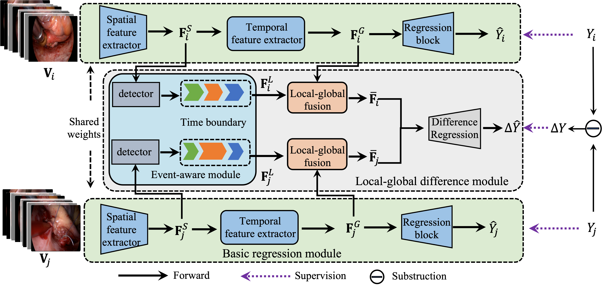

# SEDSkill: Surgical Events Driven Method for Skill Assessment from Thoracoscopic Surgical Videos

This repository contains Pytorch implementation of surgical skill assessment method: SEDSKill.



## Introduction

[SEDSkill: Surgical Events Driven Method for Skill Assessment from Thoracoscopic Surgical Videos](), MICCAI 2023

Thoracoscopy-assisted mitral valve replacement (MVR) is a crucial treatment for patients with mitral regurgitation and demands exceptional surgical skills to prevent complications and enhance patient outcomes. Consequently, surgical skill assessment (SKA) for MVR is essential for certifying novice surgeons and training purposes. However, current automatic SKA approaches have inherent limitations that include the absence of public thoracoscopy-assisted surgery datasets, exclusion of inter-video relationships, and limited to SKA of a single short surgical action. This paper introduces a novel clinical dataset for MVR, which is the first thoracoscopy-assisted long-form surgery dataset to the best of our knowledge. Our dataset, unlike existing short video clips that contain single surgical action, includes videos of the whole MVR procedure that capture multiple complex skill-related surgical events. To tackle the challenges posed by MVR, we propose a novel method called Surgical Events Driven Skill assessment (SEDSkill). Our key idea is to develop a long-form surgical events-driven method for skill assessment, which is based on the insight that the skill level of a surgeon is closely tied to the occurrence of inappropriate operations such as excessively long sutur repairing times. SEDSkill incorporates an events-aware module that automatically localizes skill-related events, thus extracting local semantics from long-form videos. Additionally, we introduce a difference regression block to learn imperceptible discrepancies, which enables precise and accurate surgical skills assessment. Extensive experiments demonstrate that our proposed method outperforms state-of-the-art approaches.

## Installation

Create the environment from the `environment.yml` file:

```
pip install -r requirements.txt
```

## Data preparation

* We are now continuing to collect more dataset for the journal verision. The dataset would be released upon the journal verision ready.

## Training and Inference

* Train the events-aware module:
  ```
  cd actionformer_release
  sh run.sh
  ```
* Train the SEDSkill:
```
python regression_main.py
```


## Acknowledgement

[ActionFormer](https://github.com/happyharrycn/actionformer_release)